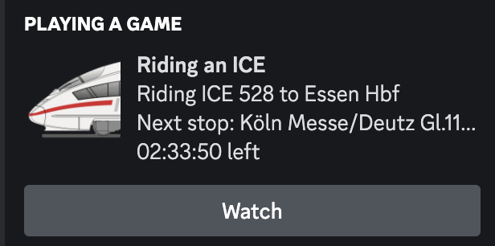

# iceportal rich presense 
Show your current ride in discord via the ICE portal api.

## Installation

Download the binary for your operating system from the current release or build it yourself.

## How does it work?

It will fetch the current trip info from the ICE portal api every 30 seconds (so you have to be on the WIFIonICE) and publish it to discord. Also the right building series will be shown as an image.

You will be asked at which station you entered the train to show the time you need to arrival in discord.
